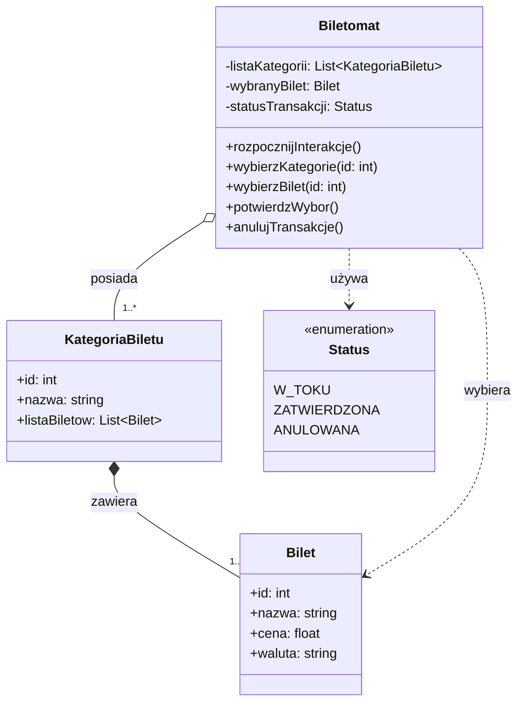
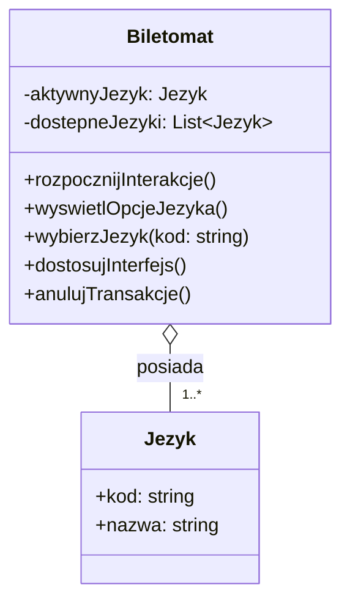

### Szybki wybór rodzaju biletu

```mermaid
classDiagram
    class Biletomat {
        -listaKategorii: List~KategoriaBiletu~
        -wybranyBilet: Bilet
        -statusTransakcji: Status
        +rozpocznijInterakcje()
        +wybierzKategorie(id: int)
        +wybierzBilet(id: int)
        +potwierdzWybor()
        +anulujTransakcje()
    }

    class KategoriaBiletu {
        +id: int
        +nazwa: string
        +listaBiletow: List~Bilet~
    }

    class Bilet {
        +id: int
        +nazwa: string
        +cena: float
        +waluta: string
    }

    class Status {
        <<enumeration>>
        W_TOKU
        ZATWIERDZONA
        ANULOWANA
    }

    %% Relacje
    Biletomat o-- "1..*" KategoriaBiletu : posiada
    KategoriaBiletu *-- "1..*" Bilet : zawiera
    Biletomat ..> Bilet : wybiera
    Biletomat ..> Status : używa
```

### Wybór języka

```mermaid
classDiagram
    class Biletomat {
        -aktywnyJezyk: Jezyk
        -dostepneJezyki: List~Jezyk~
        +rozpocznijInterakcje()
        +wyswietlOpcjeJezyka()
        +wybierzJezyk(kod: string)
        +dostosujInterfejs()
        +anulujTransakcje()
    }

    class Jezyk {
        +kod: string
        +nazwa: string
    }

    %% Relacje
    Biletomat o-- "1..*" Jezyk : posiada
```
