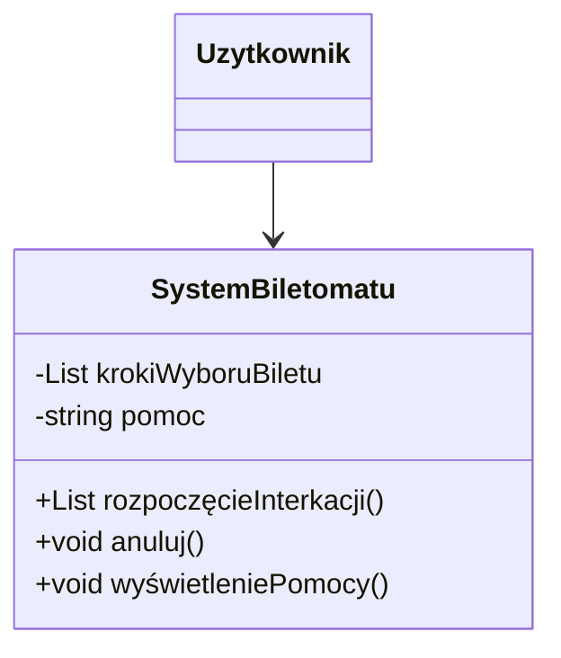

```mermaid
classDiagram

  class Uzytkownik {}

  class SystemBiletomatu {
    -List krokiWyboruBiletu
    -string pomoc
    +List rozpoczęcieInterkacji()
    +void anuluj()
    +void wyświetleniePomocy()
  }

  Uzytkownik --> SystemBiletomatu
```

```mermaid
classDiagram
  class SystemBiletomatu {
    +void anuluj()
    +void wybórPowoduAnulowania()
  }

  class Logger {
      +void zapiszLogAnulowania(powod)
  }

  class Interfejs {
    +void resetInterfejsu()
  }

    Uzytkownik --> SystemBiletomatu : anulowanie
    SystemBiletomatu --> Logger : zapis danych
    SystemBiletomatu --> Interfejs : wyswietla

```
