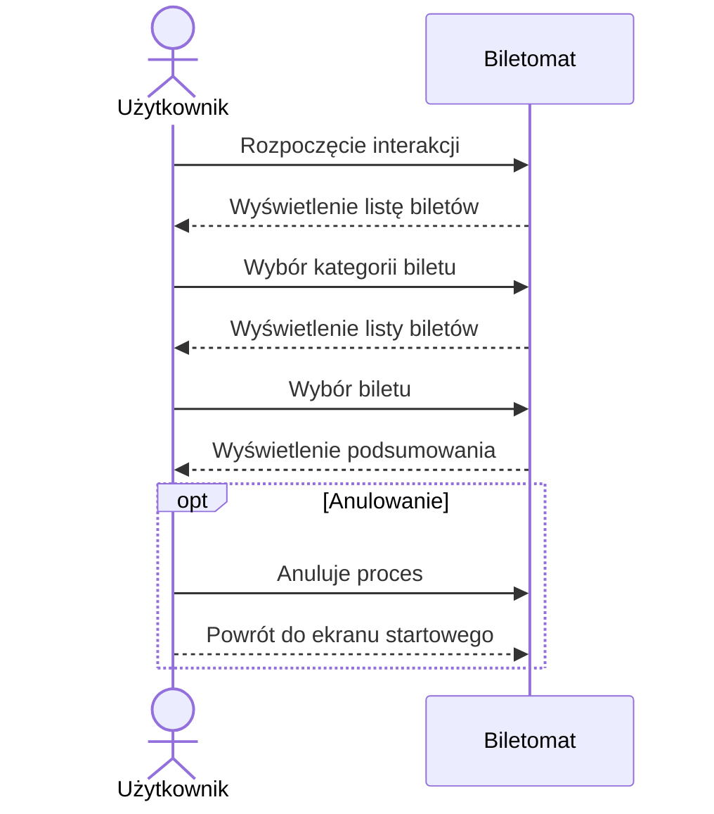
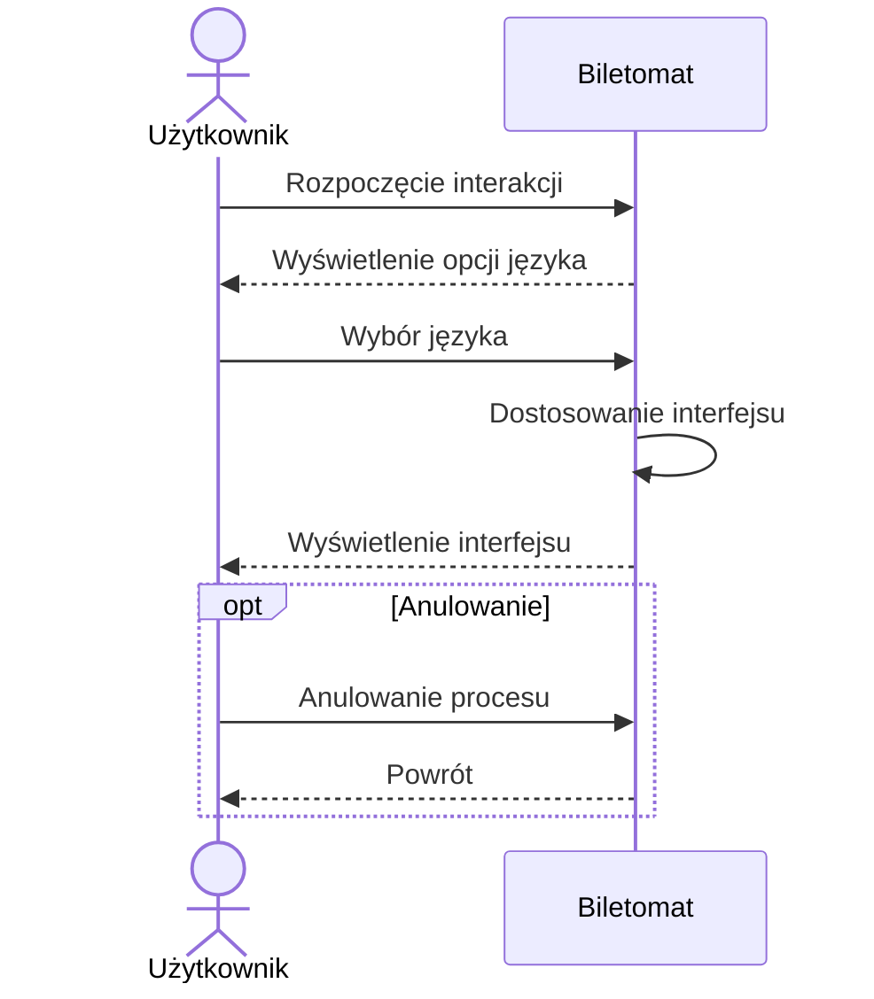

# Diagram sekwencji - Szybki wybór rodzaju biletu

```mermaid
sequenceDiagram
    actor U as Użytkownik
    participant B as Biletomat

    U ->> B: Rozpoczęcie interakcji
    B -->> U: Wyświetlenie listę biletów
    
    U->>B: Wybór kategorii biletu
    B-->>U: Wyświetlenie listy biletów
    
    U->>B: Wybór biletu
    B-->>U: Wyświetlenie podsumowania

    opt Anulowanie
        U->>B: Anuluje proces
        U-->>B: Powrót do ekranu startowego
    end

```

```mermaid
sequenceDiagram
    actor U as Użytkownik
    participant B as Biletomat

    U ->> B: Rozpoczęcie interakcji
    B -->>U: Wyświetlenie opcji języka

    U ->> B: Wybór języka
    B ->>B: Dostosowanie interfejsu
    B -->>U: Wyświetlenie interfejsu

    opt Anulowanie
        U ->> B: Anulowanie procesu
        B -->> U: Powrót
    end    
```
