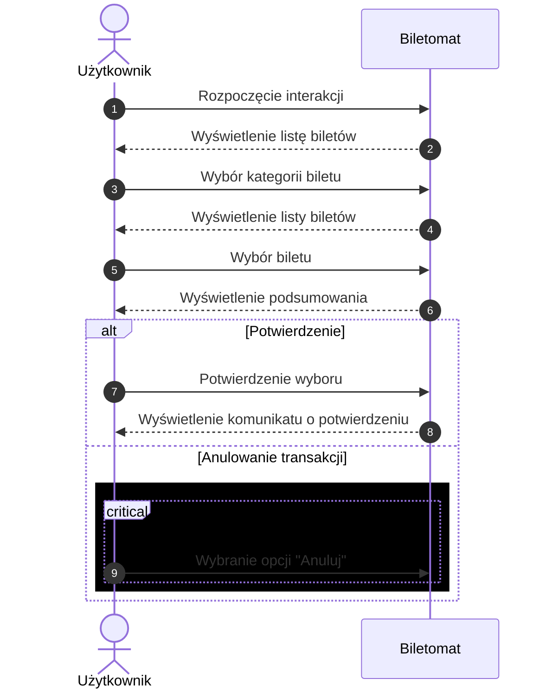
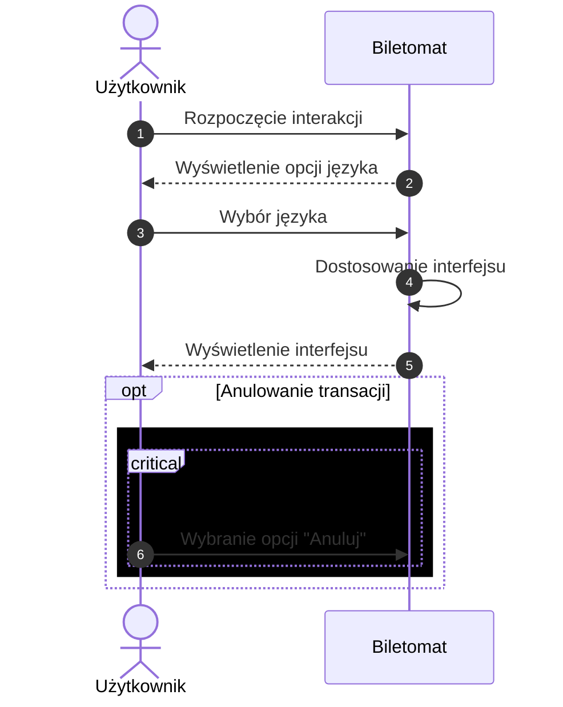
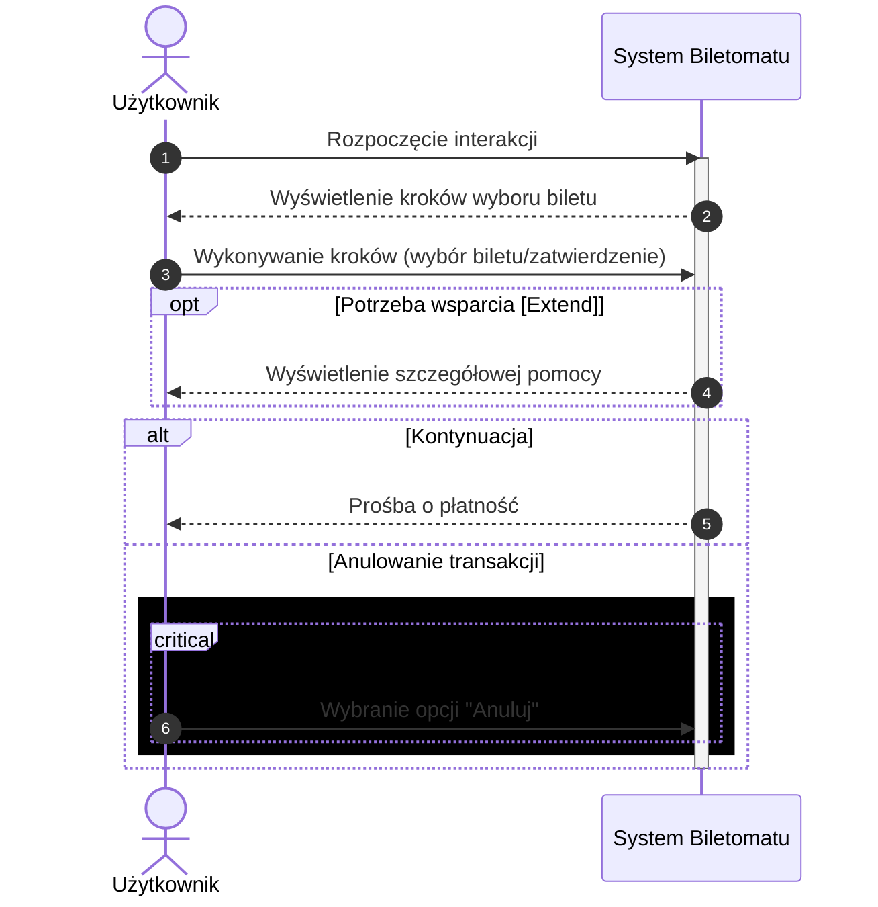
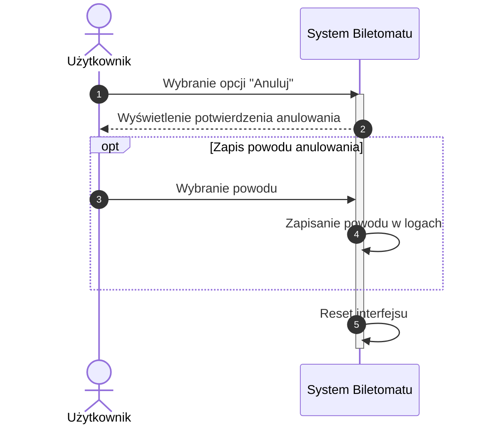

### Szybki wybór rodzaju biletu

```mermaid
sequenceDiagram
autonumber
    actor U as Użytkownik
    participant B as Biletomat

    U ->> B: Rozpoczęcie interakcji
    B -->> U: Wyświetlenie listę biletów
    
    U->>B: Wybór kategorii biletu
    B-->>U: Wyświetlenie listy biletów
    
    U->>B: Wybór biletu
    B-->>U: Wyświetlenie podsumowania

    alt Potwierdzenie
        U->>B: Potwierdzenie wyboru
        B-->>U: Wyświetlenie komunikatu o potwierdzeniu
    else Anulowanie transakcji
         rect rgb(0, 0, 0)
            critical Referencja: Anulowanie transakcji
                U->>B: Wybranie opcji "Anuluj"
            end
        end
    end

```

### Wybór języka

```mermaid
sequenceDiagram
autonumber
    actor U as Użytkownik
    participant B as Biletomat

    U ->> B: Rozpoczęcie interakcji
    B -->>U: Wyświetlenie opcji języka

    U ->> B: Wybór języka
    B ->>B: Dostosowanie interfejsu
    B -->>U: Wyświetlenie interfejsu

    opt Anulowanie transacji
      rect rgb(0, 0, 0)
            critical Referencja: Anulowanie transakcji
                U->>B: Wybranie opcji "Anuluj"
            end
        end
    end    
```
### Otrzymanie instrukcji na ekranie

```mermaid
sequenceDiagram
    autonumber
    actor Uzytkownik as Użytkownik
    participant System as System Biletomatu

    Uzytkownik->>System: Rozpoczęcie interakcji
    
    activate System
    System-->>Uzytkownik: Wyświetlenie kroków wyboru biletu
    
    Uzytkownik->>System: Wykonywanie kroków (wybór biletu/zatwierdzenie)
    
    opt Potrzeba wsparcia [Extend]
        System-->>Uzytkownik: Wyświetlenie szczegółowej pomocy
    end

    alt Kontynuacja
        System-->>Uzytkownik: Prośba o płatność
    else Anulowanie transakcji
        rect rgb(0, 0, 0)
            critical Referencja: Anulowanie transakcji
                Uzytkownik->>System: Wybranie opcji "Anuluj"
            end
        end
    end
    deactivate System
```
### Anulowanie transakcji

```mermaid
sequenceDiagram
    autonumber
    actor Uzytkownik as Użytkownik
    participant System as System Biletomatu

    Uzytkownik->>System: Wybranie opcji "Anuluj"
    
    activate System
    System-->>Uzytkownik: Wyświetlenie potwierdzenia anulowania
    
    opt Zapis powodu anulowania
        Uzytkownik->>System: Wybranie powodu
        System->>System: Zapisanie powodu w logach
    end

    System->>System: Reset interfejsu
    deactivate System
```
