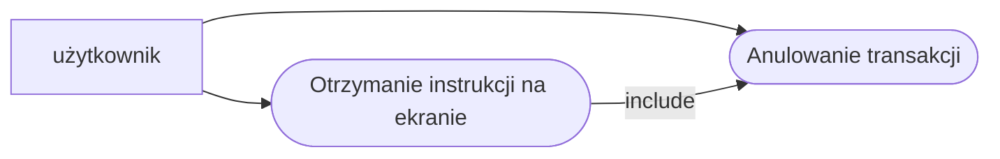

# Diagram przypadków użycia

```mermaid
flowchart LR
  użytkownik --> id6([Otrzymanie instrukcji na ekranie])
  użytkownik --> id7([Anulowanie transakcji])
  id6([Otrzymanie instrukcji na ekranie]) --include--> id7([Anulowanie transakcji])
  
```
