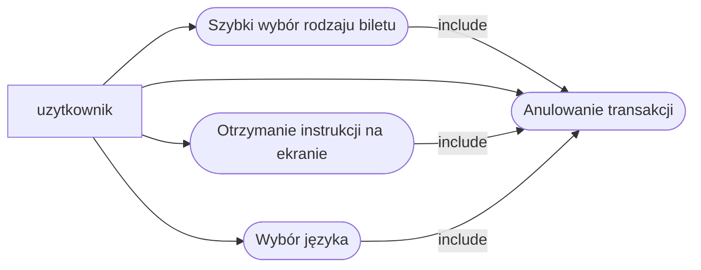

# Diagram przypadków użycia

```mermaid
flowchart LR
uzytkownik --> id1([Szybki wybór rodzaju biletu])
id1([Szybki wybór rodzaju biletu]) --include--> id7([Anulowanie transakcji])

uzytkownik --> id6([Otrzymanie instrukcji na ekranie])
uzytkownik --> id7([Anulowanie transakcji])
id6([Otrzymanie instrukcji na ekranie]) --include--> id7([Anulowanie transakcji])

uzytkownik --> id2([Wybór języka])
id2([Wybór języka]) --include--> id7([Anulowanie transakcji])
```